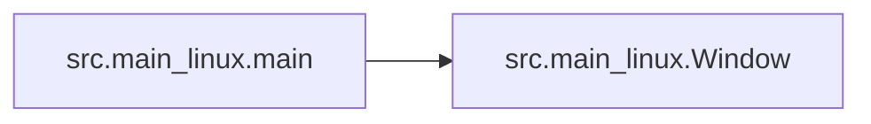

# Src Main Linux

[_Documentation generated by Documatic_](https://www.documatic.com)

<!---Documatic-section-Codebase Structure-start--->
## Codebase Structure

<!---Documatic-block-system_architecture-start--->
```mermaid
None
```
<!---Documatic-block-system_architecture-end--->

# #
<!---Documatic-section-Codebase Structure-end--->

<!---Documatic-section-src.main_linux.main-start--->
## src.main_linux.main

<!---Documatic-section-main-start--->


### Object Calls

* src.main_linux.Window

<!---Documatic-block-src.main_linux.main-start--->
<details>
	<summary><code>src.main_linux.main</code> code snippet</summary>

```python
def main():
    app = QtGui.QApplication(sys.argv)
    w = Window()
    w.show()
    sys.exit(app.exec_())
```
</details>
<!---Documatic-block-src.main_linux.main-end--->
<!---Documatic-section-main-end--->

# #
<!---Documatic-section-src.main_linux.main-end--->

[_Documentation generated by Documatic_](https://www.documatic.com)